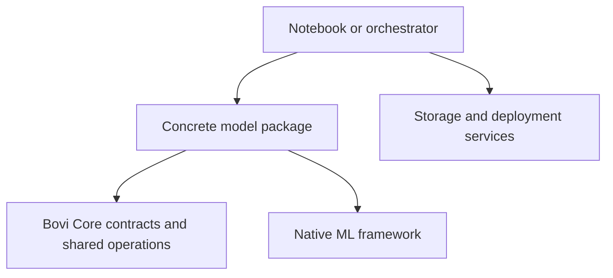
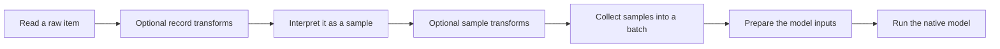
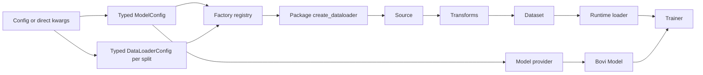
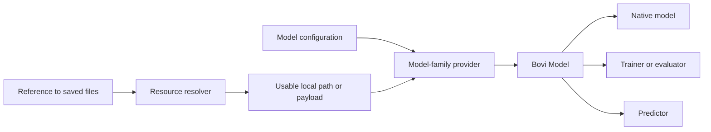
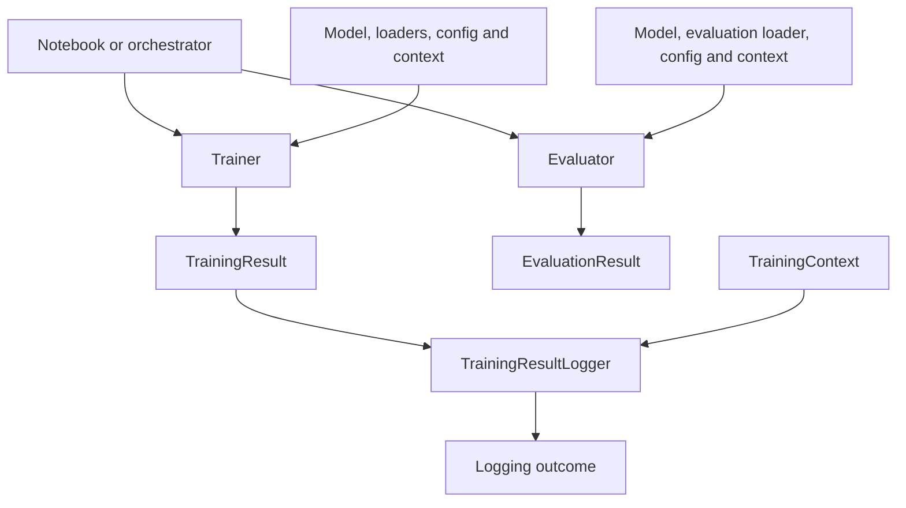
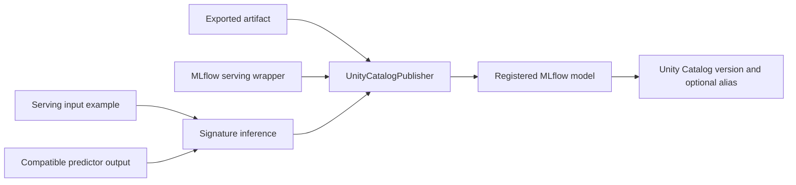

# Bovi Core: understanding the package

Bovi Core is the shared foundation beneath Bovi's model packages. Those models
can be very different: a small regression model predicts a number, an autoencoder
works with a lactation sequence, and YOLO detects objects in an image. They do not
need the same training algorithm, but they do need to read data, construct models,
make predictions and describe their results.

The package gives those common activities a recognizable structure. When you
open a second model package, you should be able to follow its data pipeline and
find its model without learning an entirely new application. At the same time,
the code that makes YOLO work like YOLO stays in the YOLO package.

This guide follows that structure from input data to a trained or deployed model.
We will use a small example along the way: predicting milk yield from a few
numeric fields, such as days in milk and parity. You do not need to know the
framework beforehand. The code links are there for when you want to look one
level deeper, not because you need to read every implementation to follow along.

## Reading map

- [What belongs in core?](#1-start-with-the-responsibility-boundaries)
- [Finding your way through the folders](#2-where-things-live)
- [Following the data](#3-follow-one-item-through-the-data-pipeline)
- [Configuring an experiment](#4-configuration-an-optional-entry-route-not-every-objects-identity)
- [Constructing and loading models](#5-models-providers-and-resources)
- [Making predictions](#6-predictors-and-the-three-result-levels)
- [Training, evaluating and saving results](#7-training-evaluation-and-logging-in-one-picture)
- [Publishing a model](#8-publishing-unity-catalog-and-signatures)
- [Finding model implementations](#9-registry-and-plugin-discovery)
- [Other package utilities](#10-storage-utilities-and-optional-integrations)
- [Examples and further reading](#11-a-practical-reading-route)

## 1. Start with the responsibility boundaries

Suppose you are adding a milk-yield model. You need to decide which fields are
inputs, how to interpret a training record and which estimator to use. Those
decisions belong to your model package. Another model might use images instead,
so putting dairy-specific field selection into core would make core less reusable.

Combining records into batches, representing a training result and writing that
result to a local file are different. Many models need those operations in much
the same way. Core provides implementations that model packages can reuse, along
with interfaces for behavior that varies between models.

An **interface**, or contract, describes what another object may rely on. For
example, a dataset must let its caller request a sample. The contract does not
say whether that sample came from an image or a JSON record. A concrete dataset
supplies that part of the behavior.

There is also code that connects everything: it chooses the configuration,
constructs the model and loaders, starts training and decides what to do with the
result. We call this the **orchestrator**. That can simply be your notebook.
In a farm deployment it can be an application running on the edge device.



The arrows mean "uses". Core does not need to know which particular model package
uses it. A model package can use both core and its native framework, such as
scikit-learn, PyTorch or TensorFlow. The orchestrator brings the pieces together.

This explains an important design choice you will see throughout the code:
objects usually **receive the dependencies they use**, rather than constructing
the entire application themselves. Passing a model and loaders into a trainer is
dependency injection. It makes the trainer easier to understand because you can
see what it will work with.

## 2. Where things live

The source is in
[packages/bovi-core/src/bovi_core](../../packages/bovi-core/src/bovi_core).
The first useful distinction is between machine-learning code in `ml/` and
supporting configuration, storage and environment code around it.

```text
bovi_core/
  config.py
  secrets.py
  spark_manager.py
  types/
  storage/
  utils/
  ml/
    registry.py
    dataloaders/
      config.py
      factory.py
      sources/
      datasets/
      transforms/
      loaders/
      batching/
      model_inputs/
    models/
    predictors/
      prediction_interface.py
      results/
    trainers/
    publishing/
    utils/
```

Read `dataloaders/` as the complete data-input part of the framework, not just
the classes whose name ends in `DataLoader`. Its subdirectories separate the
steps we will walk through next. Each contract lives beside its implementations:
for example, `datasets/base_dataset.py` sits next to `tabular_dataset.py` and
`image_dataset.py`.

Concrete model packages use a similar structure. Under `dataloaders/` you find
their domain-specific sources and datasets, plus the code that assembles them.
Under `models/` you find the model's config, runtime model and provider.
A package adds `predictors/` or `trainers/` when it supports those activities;
there is no need to create empty directories for unsupported capabilities.

## 3. Follow one item through the data pipeline

Imagine a file containing these two records:

```json
[
  {"days_in_milk": 50, "milk_yield": 31},
  {"days_in_milk": 70, "milk_yield": 29}
]
```

We want to use `days_in_milk` as the input and `milk_yield` as the target: the
value the model should learn to predict. A model cannot learn from the filename
alone. We must read a record, identify the relevant values and present a batch
in the format its framework expects.



### The source reads the raw item

A **source** answers: where is the data, and how do I read one item?
For our JSON file, `JSONRecordsSource` opens the file and makes its records
available by index. When we request the first item, we get the first dictionary.
It has not yet decided which field is a target.

Not every source returns a dictionary. `LocalFileSource` and
`BlobImageSource` return file bytes, because decoding those bytes into an image
belongs to a later step. `DictSource` is useful when records have already been
decoded and are available in memory.

The [DataSource contract](../../packages/bovi-core/src/bovi_core/ml/dataloaders/sources/base_source.py)
also exposes keys, length and metadata. Metadata tells us something about where
an item came from, such as its file or record index. It is separate from the
values the model learns from.

Our JSON reader loads the complete array into memory. That is a deliberate fit
for small examples, not a streaming solution for a very large farm dataset.
You could introduce another source for a different storage pattern without
changing the meaning of a dataset sample.

### The dataset interprets the item

A **dataset** answers the next question: what does this item mean to the model?
For our example, `TabularDataset` selects the requested numeric features and
target. Its first sample looks like this:

```python
{
    "features": {"days_in_milk": 50.0},
    "labels": 31.0,
    "metadata": {"index": 0},
}
```

The exact metadata depends on the source; the record-index example above matches
`DictSource`. The feature and label values have become floats. Unselected fields
do not automatically become model inputs.

`TabularDataset` uses the hooks supplied by `FeatureVectorDataset` to extract
features, labels and metadata. This is useful shared behavior, but it is still a
specific dataset for scalar numeric values. It does not automatically encode
categories, repair missing values or support every kind of target.

For images, `ImageDataset` instead decodes the source bytes into RGB pixels.
For videos, `VideoDataset` reads a sequence of frames, with frame selection and
resizing available during decoding to control memory use. A lactation dataset
can assemble the sequences and domain fields that its autoencoder needs.
They share the [Dataset interface](../../packages/bovi-core/src/bovi_core/ml/dataloaders/datasets/base_dataset.py),
not necessarily the same sample structure.

### Transforms make preprocessing visible

Before training, we might want to clip an implausible value or scale days in milk
to a smaller numeric range. Those are **transforms**: explicit operations that
change an item or sample.

Their position matters. A transform that needs fields from the original record
belongs before the dataset selects its features. `TransformedSource` wraps a
source for that purpose. A transform that needs decoded image pixels belongs
after image decoding. `TransformedDataset` wraps a dataset for that purpose.

Both wrappers apply their ordered transforms when an item is requested. The
underlying source or dataset still has one clear job, and you can inspect the
transform list to understand what preprocessing is being performed.

The [transform directory](../../packages/bovi-core/src/bovi_core/ml/dataloaders/transforms)
contains numeric clipping and scaling, time-series operations such as imputation
and padding, and vision transforms. `TransformRegistry.from_config()` constructs
the ordered list from configuration; the source or dataset wrapper executes it.
Using the same transform twice is possible because this is a list, not a mapping
with one entry per name.

For images, it is particularly important not to hide preprocessing in batching.
PyTorch models often expect a different axis order from decoded image files.
`ImagePreprocessing(normalize=True, channels_first=True)` explicitly requests
uint8 scaling to float32 divided by 255 and a change from HWC to CHW. In those
names, H and W are height and width, and C is the color-channel axis.
Both options default off, and floating-point images are not scaled again.

An augmentation library can be used just as explicitly. Given an existing image
dataset and Albumentations pipeline, we could compose:

```python
from bovi_core.ml.dataloaders.datasets import TransformedDataset
from bovi_core.ml.dataloaders.loaders import PyTorchDataLoader
from bovi_core.ml.dataloaders.transforms import (
    AlbumentationsTransform,
    ImagePreprocessing,
)

prepared = TransformedDataset(
    image_dataset,
    transforms=[
        AlbumentationsTransform(augmentation_pipeline),
        ImagePreprocessing(normalize=True, channels_first=True),
    ],
)
loader = PyTorchDataLoader(
    prepared,
    split="train",
    batch_size=16,
    shuffle=True,
    seed=42,
    num_workers=0,
)
```

The order says: augment decoded pixels first, then prepare their numeric range
and layout. When images have masks or bounding boxes, include those targets in
the augmentation setup so they receive matching spatial changes.

### The loader makes batches

Our dataset can return one sample. A **loader** decides which samples to visit
and collects them into batches. It owns choices such as batch size and shuffling.
A loader represents one split, so a training setup may contain separate
`train` and `validation` loaders over different datasets.

Combining samples into one batch is called **collation**. With both example
records in a batch, NumPy collation produces this structure:

```text
features: {"days_in_milk": array([50.0, 70.0])}
labels:   array([31.0, 29.0])
metadata: one metadata record per sample
```

The [batching helpers](../../packages/bovi-core/src/bovi_core/ml/dataloaders/batching)
combine matching nested fields and stack compatible numeric values. Metadata
stays associated with each sample. Values that cannot form a regular numeric
array, such as differently sized sequences, may remain lists; that does not
mean every model can consume them.

Core supplies `SklearnDataLoader`, `PyTorchDataLoader` and
`TensorFlowDataLoader`. They integrate this input pipeline with their framework's
way of iterating and batching. PyTorch supports native worker processes and
tensor batches. TensorFlow uses `tf.data` generation, batching and prefetching:
preparing later batches while the current one is being processed.

Runtime loaders receive only explicit values such as `split`, `batch_size`,
`shuffle`, worker settings and the dataset itself. They do not inspect the
global `Config`, resolve YAML paths or receive a `model_name`. This keeps an
already-built loader independent from how its settings were supplied.

These implementations do not need to perform identical internal steps to share
the same role. TensorFlow already has its own batching machinery, for example.
Its batches must have representable tensor types, so opaque metadata may need
to be omitted explicitly with `drop_keys=("metadata",)`.

### Model-input preparation finishes the job

Our batch still contains named fields. A regression estimator usually expects a
matrix `X` and a target vector `y`. The final preparation step turns the batch
into:

```text
X = [[50.0], [70.0]]
y = [31.0, 29.0]
```

With several features, each row of `X` describes one sample and each column
describes one feature. The column order must remain stable between training and
prediction. The helpers in
[model_inputs](../../packages/bovi-core/src/bovi_core/ml/dataloaders/model_inputs)
use explicit `feature_names` to establish that order and check the scalar
regression inputs.

This is why model-input preparation is separate from batching. Batching preserves
a dataset's structure; input preparation understands what a particular task needs.
The NumPy, PyTorch and TensorFlow implementations are in separate files so their
framework-specific operations are easy to find. These helpers are optional
reuse for scalar regression, not a universal input format for images or LLMs.

### A factory connects these objects

The model package's `dataloaders/factory.py` is where this composition usually
comes together. A normal function with the following shape constructs the
source, applies transforms, creates the dataset and returns a loader:

```python
def create_dataloader(data_config, model_config) -> AbstractDataLoader:
    ...
```

Its concrete annotations use that package's `DataLoaderConfig` and
`ModelConfig` subclasses. The function structurally implements Bovi Core's
`DataLoaderFactory` callable protocol: inheritance or a factory class is not
required. `data_config` owns the settings for one split; `model_config` supplies
stable model requirements such as feature names or input dimensions.

Installed model packages publish that function through the
`bovi.dataloader_factories` entry-point group. Callers that do not want a
package-specific import use the thin core dispatcher:

```python
from bovi_core.ml import create_dataloader

loader = create_dataloader("scikit_sgd", data_config, model_config)
```

`DataLoaderFactoryRegistry` resolves the key and invokes the package function.
It does not inspect or modify either config and contains no model-specific
pipeline logic. Directly calling the package factory remains useful in package
tests and explicit composition code.

Calling this a factory simply means it constructs an object for the caller.
It is not another processing layer. Most of its work should be connecting
reusable core objects; domain-specific interpretation stays in the source,
dataset or transform that actually performs it.

## 4. Configuration: an optional entry route, not every object's identity

Now that the pipeline is concrete, configuration becomes easier to understand:
it records the choices needed to build that pipeline and run an experiment.

There are two useful levels. The existing `Config` object reads project TOML,
experiment YAML and environment-related settings. Typed, immutable Pydantic
configs then select and validate only the settings needed by one component.

For example, the model config describes the architecture and feature names.
The training config describes how to train it. The evaluation config describes
which evaluation settings to use. A trainer does not need all the project paths
and secret-management settings just to read its learning rate.

The [scikit SGD YAML](../../packages/models/scikit-sgd/data/experiments/scikit_sgd/versions/v1/config/config.yaml)
keeps these choices together under the selected model:

```text
models:
  scikit_sgd:
    type: ...
    framework: ...
    architecture: ...
    dataset: ...
    dataloaders:
      train: ...
      validation: ...
    training: ...
    evaluation: ...
```

Here `dataset` contains model-package-specific settings shared by the splits.
Every entry under `dataloaders` becomes a separate immutable
`DataLoaderConfig` instance. Its concrete package subclass owns its typed
`dataset`, `source`, `transforms` and loader settings; core does not prescribe
one universal schema for images, tabular records and time series. Split names
are not limited to `train` and `validation`.

`framework` appears only at model level. A split describes data construction,
not which framework owns the model. `architecture` likewise belongs to the
model definition, not the training attempt.

A concrete data config's `from_config(config, split)` method optionally adapts
this YAML structure. It combines
`models.<model_key>.dataset` with
`models.<model_key>.dataloaders.<split>` and validates the result as one split
config. Alternatively, construct the exact same object directly with keyword
arguments. YAML is therefore an input adapter, not a runtime dependency.

You will see `model_key: ClassVar[str]` on concrete config classes. This tells
`from_config()` which model section to select. It belongs to the class, while
values such as a learning rate belong to a config instance.
Pydantic's `model_validate()` validates input and creates that instance; it
does not turn experiment values into class attributes.

`config_node_to_data()` supports this boundary by copying a selected YAML
configuration node into ordinary data. Only selected settings should enter a
typed config or log snapshot. The entire `Config` object also relates to paths,
clients and secrets, which are not suitable training-result metadata.

The resulting construction flow is:



Only the optional adapter sees the broad `Config`. Factories and runtime
loaders consume typed objects and explicit values. The current YOLO factory
supports a local source. A future remote source should receive its blob client,
credentials abstraction or resolver explicitly; it must not smuggle the global
`Config` into the runtime pipeline.

When composing several runs, pass configuration explicitly. No-argument
`Config()` can reuse earlier singleton state, which is convenient in a notebook
but less obvious in an application managing multiple experiments.
The [configuration source](../../packages/bovi-core/src/bovi_core/config.py)
contains the project discovery, path-template and file-tracking details.

## 5. Models, providers and resources

Once the data setup is ready, we need a model. There are two related objects
to recognize here: the framework's native model, such as an `SGDRegressor`,
and the Bovi `Model` that wraps it with its typed configuration and runtime
behavior.

The [Bovi Model](../../packages/bovi-core/src/bovi_core/ml/models/model.py)
receives an already constructed `native_model`. It does not need to decide
where weights are stored or which cloud account to contact. Those questions
arise before it can do its job.

A **provider** handles the model-family-specific construction. If we are starting
from scratch, `provider.create(model_config)` builds a fresh model. If we have
saved state, the provider knows how that model family loads it.

There are two saved-state routes because they serve different purposes.
`restore_checkpoint()` restores supported training state; `load_artifact()`
loads an exported representation intended for use such as serving.
They are separate capabilities. A provider only has to support the operations
its model family actually offers.



A **resource resolver** takes care of locating saved content. A reference may
point at a local checkpoint directory or an artifact stored elsewhere. The
resolved resource gives the provider a usable path or payload.
The resolver understands storage; the provider understands the model format.

For our small example, that separation means the same provider can restore a
checkpoint once its files are available, regardless of which application arranged
for them to arrive. The model itself does not need a Blob client.

### Saving a checkpoint

A checkpoint gives us a saved point we can load later. Core's
[LocalCheckpointStore](../../packages/bovi-core/src/bovi_core/ml/models/checkpoints.py)
asks the concrete implementation to write its native files, adds a manifest
describing them and publishes the completed bundle. The result is a reference
rather than a second in-memory model.

The manifest includes checksums: values calculated from file content that let
the resolver detect changed or damaged files. A checksum verifies integrity,
not whether a model from an unknown source is safe to deserialize.

It is important to distinguish "load the saved weights" from "resume every detail
of execution". Current manifests advertise `weights_only` recovery. Exact
optimizer, random-generator and data-order continuation is not a promise across
all frameworks. The [trainer guide](trainer-module.md#checkpoints-and-resume)
explains those recovery boundaries in more detail.

Exporting a deployment artifact is another operation. A PyTorch weights
dictionary, a complete serialized model and an ONNX export are different
representations. Training does not automatically convert between them, and
export remains outside the trainer.

## 6. Predictors and the three result levels

A trained or loaded model becomes useful when something can ask it for a
prediction. The **predictor** provides that application-facing operation.
It receives the model, handles the input form expected by that implementation
and returns the requested representation of the prediction.

The [prediction interface](../../packages/bovi-core/src/bovi_core/ml/predictors/prediction_interface.py)
provides this shared boundary, including initialization and cleanup.
Its callable-model protocol says that a consumer needs an object it can call.
A compatible object can satisfy that requirement without inheriting a particular
class; the protocol describes the operation, not how to discover the object.

The three result levels serve different callers. With `raw`, you keep the native
output for further framework-specific work. With `base`, you request a portable
dictionary that generic downstream code can inspect. With `rich`, you get a
result object with domain-oriented behavior, such as readable summaries or
visualization.

For example, a detection result can offer more useful presentation than a bare
tensor of coordinates. That presentation belongs in its concrete result class.
The [base result interfaces](../../packages/bovi-core/src/bovi_core/ml/predictors/results/base.py)
describe common operations such as serialization and counting predictions;
`GenericPredictionResult` covers common NumPy outputs.

Conversion is still the concrete predictor's responsibility. Merely inheriting
the prediction interface does not make every native output serializable.
This is also why a prediction result is not a training result: one describes
what the model predicted, while the other describes what happened while learning.

## 7. Training, evaluation and logging in one picture

Our orchestrator now has a model, loaders and validated settings. It passes them
to a concrete trainer and calls `train()`. The trainer performs the native
training work and returns a `TrainingResult`.

That result lets the caller understand the attempt without inspecting the
trainer's internal loop. It records outcomes such as status, per-epoch metrics,
issues and references to saved checkpoints. The model itself remains accessible
through the trainer rather than being copied into the result.



**Context** describes this particular execution: its identity, why it was started
and where outputs belong. Config instead describes the parameters used to run
it. Keeping these apart makes it possible to reuse settings for a new attempt
without pretending it is the same run. General contexts do not require farm
information; federated subclasses add farm and round identity when needed.

After training, an **evaluator** measures a model on a selected dataset split.
It receives a model and evaluation config, then evaluates a loader with its
evaluation context. It does not need the previous training result. You could
evaluate a model loaded from an artifact just as well.

Finally, the caller decides to save the training result through a
`TrainingResultLogger`. Logging has its own outcome because successful training
and successful storage are different facts. A storage failure should be visible
and retryable without changing a completed training attempt into failed training.

The local logger writes a final-attempt JSON manifest containing context, result
and selected metadata/configuration snapshots. It stores checkpoint references,
not the checkpoint files themselves. Its write guarantees and retry behavior
are explained in [local result persistence](trainer-module.md#local-result-persistence).

The [trainer guide](trainer-module.md) is the detailed companion to this overview.
It covers the class relationships, statuses, checkpoint selection, evaluation
and federation boundaries. The current core does not schedule farms or aggregate
their updates; an orchestrator would build on these contracts to do that.

## 8. Publishing, Unity Catalog and signatures

Training and local inference are not the same as deployment. To serve a model,
we need a saved representation a serving process can load, the necessary
dependencies and a clear input/output interface.

The publishing module connects these pieces to MLflow and Unity Catalog.
MLflow's serving wrapper knows how to load and call the exported model.
Unity Catalog registration gives that published model a version and, optionally,
an alias through which a deployment can refer to it.



A **serving signature** describes input and output names, shapes and types.
It helps consumers know what to send. It is not a cryptographic signature or a
checksum.

A dataset can provide an input example, but training samples also contain labels
and metadata that may not belong in a serving request. The
[signature helpers](../../packages/bovi-core/src/bovi_core/ml/publishing/signatures.py)
select the serving fields and can use a compatible predictor to infer outputs.
`Dataset.get_mlflow_signature()` delegates to those publishing helpers; loading
ordinary dataset samples does not require MLflow.

The [UnityCatalogPublisher](../../packages/bovi-core/src/bovi_core/ml/publishing/unity_catalog.py)
receives the exported artifact, serving wrapper, dependencies, examples and
registration settings. It does not train or export the model itself.

The MLflow wrapper is also different from the Bovi runtime model. Its job is to
satisfy MLflow's loading and prediction interface. The supplied artifact must
match that wrapper: a wrapper expecting a complete PyTorch module cannot
automatically load an arbitrary weights-only training checkpoint.

Before publishing, check the same serving example against the exported wrapper.
A signature inferred through a runtime predictor alone does not establish that
the wrapper accepts the same input. Output inference can also fall back to an
input-only signature when prediction fails, so its warnings matter.

For TensorFlow SavedModels, the core serving wrapper accepts a dictionary of
named, batched arrays and returns a dictionary of named output arrays. Each
input must match the SavedModel's shape, and all inputs share the same batch
size. The wrapper converts input dtypes according to the native signature;
it does not guess model-specific preprocessing. The lactation package's
`LactationSavedModelWrapper`, for example, adds the milk channel dimension.

The lactation notebooks infer their MLflow signature from the serving wrapper's
actual output, then pass both `input_example` and `signature` to the publisher.
They first save and reload the MLflow model locally and compare its predictions.
That checks serialization and the serving contract without publishing anything.
It does not check cloud permissions or whether a clean deployment environment
can install all the recorded dependencies.

## 9. Registry and plugin discovery

So far, we have assumed the orchestrator knows which provider to construct.
That is easy with one model package. As more packages are added, we do not want
core to maintain a list of imports for every concrete model.

A **registry** provides lookup by name. The
[ModelProviderRegistry](../../packages/bovi-core/src/bovi_core/ml/registry.py)
can find a provider class and create its instance. The caller then asks that
provider to create or load a model. These are two separate construction steps.

Model packages register providers with `@ModelProviderRegistry.register("name")`
and also advertise them through their package metadata. For scikit SGD, the
metadata entry is:

```toml
[project.entry-points."bovi.model_providers"]
scikit_sgd = "scikit_sgd.models.provider:ScikitSGDModelProvider"
```

This is a Python package **entry point**: a named reference to code in an installed
package. Core can discover it without hardcoding that package's import path.
The decorator performs registration when the module is imported; the entry point
provides the discovery route that makes that import possible on demand.

Predictors use their own registry and the `bovi.predictors` entry-point group.
Data pipeline factories use `DataLoaderFactoryRegistry` and the
`bovi.dataloader_factories` group. Their entry points target functions rather
than classes:

```toml
[project.entry-points."bovi.dataloader_factories"]
scikit_sgd = "scikit_sgd.dataloaders.factory:create_dataloader"
```

The core `create_dataloader(model_key, data_config, model_config)` function only
performs lookup and delegation. Source, transform, dataset and native-loader
construction remain in the model package.

Transforms have a registry too, but custom transform modules currently need to
be imported explicitly. Provider discovery does not also discover transforms.

This mechanism answers "where is the implementation?" Interfaces and type
annotations answer "what can a caller expect from it?" Neither replaces the
other, and registration alone does not validate every combination of model,
configuration and loader.

## 10. Storage, utilities and optional integrations

The remaining package code supports these workflows without itself being a model
or a data pipeline.

`storage/blob_store.py` provides Blob transport operations, such as reading
bytes or writing compressed JSON through a supplied client. A source could use
storage to read an item, but the storage service does not decide what that item
means to a dataset. Similarly, a checkpoint resolver may use storage without
becoming part of a native model.

The top-level `utils/` directory contains project-path, configuration and
environment helpers. `path_utils.py` locates project and experiment paths;
`config_utils.py` supports configuration tracking and validation.
`blob_utils.py` and `dbfs_utils.py` provide storage/file conveniences.
`compute_utils.py` and parts of `env_utils.py` support Databricks operations,
while `code_utils.py` contains development-tooling helpers.

Those cloud operations should be invoked deliberately. Creating compute or
changing a secret scope is different from transforming an in-memory record.
`secrets.py` handles secret lookup, and `spark_manager.py` supports optional
Spark/dbutils integration. Neither is necessary just to train our small CPU
example. `types/config_types.py` supplies annotations for configuration nodes;
it is not the Pydantic validation layer.

Under `ml/utils/`, the helpers are closer to prediction output.
`format_conversion.py` deals with formats such as bounding-box coordinates.
`signature_utils.py` supplies conversion used by publishing. Its ownership
would be clearer beside the publishing helpers; that is a follow-up recommendation,
not something a model author needs to reproduce.

Not everything suggested by a filename is implemented. `utils/data_utils.py`
contains placeholder conversion/benchmark functions, and `utils/unity_utils.py`
is empty. Use the publishing module for the Unity Catalog behavior described here.

Core does not declare the large ML frameworks as dependencies. Concrete packages
and their environments provide the frameworks they need. Optional integrations
still require their supporting libraries when used; an environment containing
every model package can hide missing optional-import boundaries.

## 11. A practical reading route

The [scikit SGD package](../../packages/models/scikit-sgd/src/scikit_sgd)
is the simplest place to see the complete story in code. Start with its data
factory, then read the model config/provider and trainer. Its
[training notebook](../../packages/models/scikit-sgd/notebooks/experiments/scikit_sgd/scikit_sgd_training.ipynb)
connects those pieces with a small dataset, evaluation, local logging and loading
a saved checkpoint.

Next, compare [PyTorch linear](../../packages/models/pytorch-linear/src/pytorch_linear)
and [TensorFlow linear](../../packages/models/tensorflow-linear/src/tensorflow_linear).
The numerical training code differs, but the surrounding responsibilities should
be recognizable. That is the point of the framework: shared structure and useful
shared behavior, without pretending every optimizer works the same way.

Once that feels familiar, the [YOLO](../../packages/models/bovi-yolo/src/bovi_yolo)
and [lactation autoencoder](../../packages/models/lactation-autoencoder/src/lactation_autoencoder)
packages show why domain-specific datasets and result objects are valuable.
Their richer inputs are easier to follow once the source/dataset/loader
distinction is clear.

## 12. What the sibling repositories contribute

The [repository guide](repository-guide.md) explains how the neighboring
repositories relate to the monorepo. Their documentation contributes useful
background: the template explains the separation between core, model code and
experiments; the Douwe repository gives the dairy-domain narrative; and the
tutorial presents the concepts as a sequence of lessons.

For current executable examples, select a monorepo checkout containing the
documented interfaces. The sibling repositories also retain historical source
and experiments. Their updated reading instructions explain which environment
an example belongs to, so historical implementation and current usage are not
silently mixed.

The [notebook verification record](notebook-validation.md) shows which lessons
were executed locally and which sections need additional cloud access or files.

The standalone core preserves the earlier package's history. It is useful context,
but installing that old checkout is not the way to obtain the current framework.

## 13. Findings and follow-up work

This guide describes current behavior, not a promise that every integration is
finished. The separate [technical review notes](bovi-core-review-notes.md) record
the concrete publishing, utility and dependency issues found while checking the
documentation against code.

For planned training capabilities, such as fuller crash recovery and cloud result
logging, see the [trainer limitations](trainer-module.md#current-limitations-and-future-work).
These details are deliberately outside the main reading route: you should first
be able to understand the working pieces and how to connect them.
