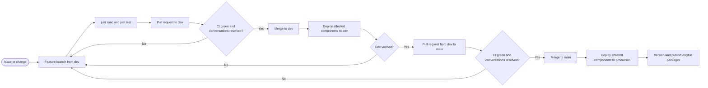

# Meike handover: contributing and releasing Bovi

This is the short operational guide for the person responsible for Bovi. The
current `bovi` monorepo is the source of truth. Historical sibling repositories
are useful background, but changes, CI, deployments, and releases happen here.

## The normal path to production



The merge is the manual gate. Opening a pull request only runs checks; it does
not deploy. A deployment starts after a pull request is merged and GitHub pushes
the merge commit to `dev` or `main`.

## Contributing day to day

Start new work from an up-to-date `dev` branch:

```bash
git switch dev
git pull --ff-only
git switch -c feature/short-description
just sync
```

Keep a branch focused and make reviewable commits. Conventional commit subjects
are preferred, for example `feat(bovi-core): add aggregation strategy` or
`fix(lactationcurve): handle an empty group`. Never commit `.env` files,
credentials, customer data, or model weights.

Before pushing:

```bash
just test
just lint
just typecheck
git status
git push -u origin feature/short-description
```

`just sync` installs all workspace dependencies and activates the repository's
Git hooks. `just test` uses `scripts/test_affected.py`: it selects tests from the
Git changes instead of always running every pytest test. Use `just test-all` for
a deliberate full Python regression, especially after broad dependency,
workspace, or shared-contract changes. `just lint` fixes Ruff findings and
formats files, so review its changes before committing. CI independently runs
the full test, API test, Ruff, formatting, and BasedPyright checks.

Open the first pull request from the feature branch into `dev`. Explain what
changed, how it was tested, and anything that needs manual verification. Fix a
failed check on the same branch; do not merge around it. After merge, verify the
dev environment. When the tested set is ready for production, open one pull
request from `dev` into `main`.

## What GitHub currently enforces

Both `dev` and `main` currently have the same branch protection:

- changes go through a pull request;
- `test`, `api-test`, and `lint` must be up to date and successful;
- review conversations must be resolved;
- force-push and branch deletion are disabled;
- the rules also apply to administrators;
- the required human approval count is **zero**.

The `dev` and `main` deployment environments currently have no required
reviewers. In other words, GitHub provides automated checks and the human merge
button is the release decision, but there is no mandatory second-person
approval. Reviews are still strongly recommended for risky changes. Changing
the approval count or adding environment reviewers is an operational policy
change, not a code change; record it here if the setting changes.

## What deploys after a merge

`.github/workflows/deploy.yml` runs on pushes to `dev` and `main` only when a
deployment-relevant path changed. `dev` selects the dev Pulumi stack; `main`
selects production. The workflow detects the affected area and skips unrelated
jobs:

| Changed area | Main deployment work |
| --- | --- |
| Central API | Build immutable API image, apply deployment state, run migrations and admin bootstrap, roll out, health-check |
| Dashboard | Build immutable dashboard image, apply deployment state, roll out, health-check |
| Infrastructure | Apply the selected Pulumi stack |
| Lactation curves | Package and deploy the curves Function App, check triggers, run a fit smoke-test |
| Autoencoder | Sync model assets, package and deploy the Function App, check triggers and health |
| `bovi-core` | Redeploy both Function Apps because both bundle the shared core |

The job called `infra` also runs for API or dashboard releases. That does not
necessarily mean infrastructure source changed: Pulumi is also used to point
existing Container Apps at the newly built immutable image.

The workflow can also be started manually from **Actions > Deploy > Run
workflow**, with a target and environment. Treat manual production runs as a
recovery tool: select the `main` ref, check the target and `prod` input twice,
and link the run to an issue or incident. There is currently no environment
reviewer to catch a wrong manual production selection.

## Versions and package publishing

After a successful deployment from `main`, `.github/workflows/bump-version.yml`
runs automatically. It uses conventional commits and package path filters. It
creates a release only when semantic-release finds an eligible change since the
latest tag.

Currently automated:

- `lactationcurve`: GitHub release, tagged build, and PyPI publish;
- `lactation-autoencoder`: GitHub release only;
- `bovi-yolo`: GitHub release only.

`bovi-core` and `bestpred` are not yet in this release matrix. A successful
Version Bump run may therefore make no new tag, and changes limited to these two
packages are not automatically published. Add an explicit release policy and
workflow entry before relying on either package as a versioned external
dependency.

## Working with federated-learning contributors

Following [GitHub's repository role guidance][github-roles], give Meike
**Maintain** access for day-to-day ownership; reserve **Admin** for managing
access, secrets, branch rules, and environments. Give collaborators who only
need to read and review **Read** or **Triage** access. Grant **Write** only when
they need repository branches and are trusted to run Actions: GitHub requires
Write access for [manual workflow runs][github-manual-workflow], so with the
current environment settings it also carries meaningful deployment power. Use
an organisation team when more than one external contributor joins, rather than
granting unrelated permissions individually.

For work built on `bovi-core`:

- keep `bovi-core` framework-agnostic and do not add TensorFlow, PyTorch, or a
  federated-learning framework as a core dependency;
- put generic contracts and small shared utilities in `packages/bovi-core/`;
- put framework-specific implementations in a separate model/package area;
- import from `bovi_core`, never from `src.bovi_core`;
- add integration tests when a change crosses package or service boundaries;
- request review from Meike and at least one domain contributor for shared
  contracts, even though GitHub does not currently require an approval.

Before external teams consume `bovi-core` from PyPI, resolve the missing
automated `bovi-core` release noted above. Until then, agree on an immutable Git
tag or commit SHA rather than depending on a moving branch.

## When something goes wrong

- **CI fails:** open the failed job, fix the cause on the feature branch, and
  push again. Do not merge merely by rerunning until it happens to pass.
- **Dev deploy fails:** do not promote `dev` to `main`; fix forward through a
  pull request and revalidate dev.
- **Production deploy fails:** preserve the logs, create an issue/incident, and
  revert the merge through a pull request or manually redeploy a known-good
  revision. Never rewrite `main` history.
- **Infrastructure change:** run and review a Pulumi preview. The PR preview
  trigger is currently disabled, so this is a manual responsibility.
- **Access or secret issue:** Meike coordinates with an organisation admin;
  secrets must remain in GitHub/Azure, never in repository files or logs.

## Ownership checklist

Meike should be able to access GitHub Actions, deployments, repository settings,
Azure resources/logs, Pulumi state and passphrase, GHCR packages, and PyPI trusted
publishing. Keep at least one backup organisation admin. When changing CI or
deployment policy, test on `dev`, document the new rule here, and only then
promote it to `main`.

[github-manual-workflow]: https://docs.github.com/en/actions/how-tos/manage-workflow-runs/manually-run-a-workflow
[github-roles]: https://docs.github.com/en/organizations/managing-user-access-to-your-organizations-repositories/managing-repository-roles/repository-roles-for-an-organization
