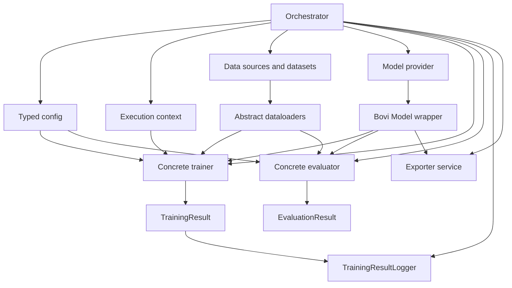
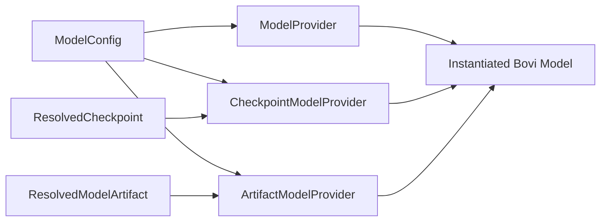
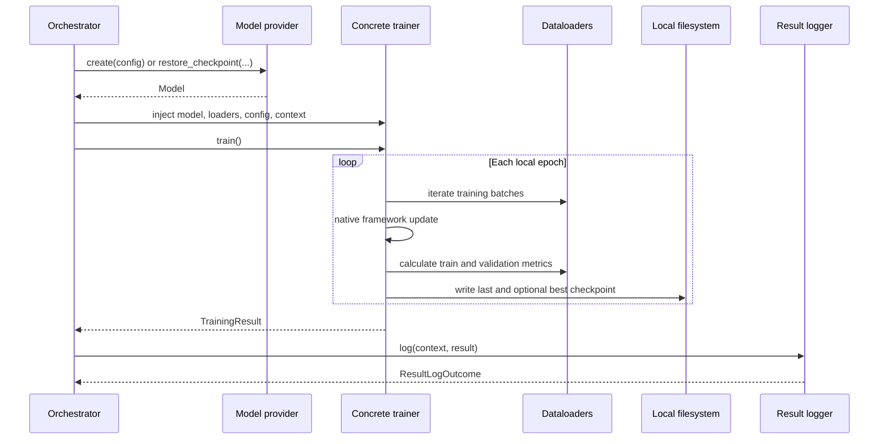

# Bovi Core trainer module

This document describes the trainer architecture implemented in Bovi Core and
the `scikit-sgd` reference package. It records both the current contracts and
the reasoning behind their boundaries.

The trainer module is deliberately small. Bovi Core defines framework-neutral
contracts and result schemas. Model packages implement the framework-specific
behaviour. Orchestrators decide when and where work runs, while storage,
logging, model export, and federated aggregation remain separate services.

## Goals

The module must support different model families without forcing their native
training APIs into one artificial universal API. Examples include PyTorch,
TensorFlow/Keras, Ultralytics YOLO, classical scikit-learn models, forecasting,
and future federated-learning clients.

The V1 design provides:

- typed, immutable model, training, and evaluation configuration;
- dependency-injected models and dataloaders;
- one framework-neutral trainer contract;
- one framework-neutral evaluator contract;
- immutable manifests for training and evaluation outcomes;
- local checkpoint references for best and last model state;
- general execution contexts with optional federated specialisation;
- structured warnings and errors;
- an asynchronous result-logging contract;
- a complete CPU-only `scikit-sgd` reference implementation.

It does not attempt to provide a universal training loop in Bovi Core.

## Core philosophy

### Core owns contracts, model packages own behaviour

`bovi-core` must remain slim and must not depend on TensorFlow, PyTorch,
Ultralytics, or scikit-learn. It knows that a trainer receives a Bovi model,
dataloaders, a typed config, and optional execution context. It does not know
whether training means `fit()`, `partial_fit()`, a custom gradient loop, or an
Ultralytics command.

A concrete package owns:

- its native framework dependency;
- its concrete `Model` wrapper and `ModelConfig`;
- model construction and restoration providers;
- its concrete `TrainingConfig` and `Trainer`;
- its concrete `EvaluationConfig` and `Evaluator`;
- conversion from generic dataloader batches to native model inputs;
- framework-specific checkpoint serialization.

This keeps framework boilerplate close to the framework that requires it and
prevents Bovi Core from becoming a second ML framework.

### Dependency injection over hidden construction

The trainer receives already-created dependencies:

```python
trainer = ConcreteTrainer(
    model=model,
    dataloaders={"train": train_loader, "validation": validation_loader},
    config=training_config,
    context=training_context,
)
```

The trainer does not discover data, read YAML, download weights, create cloud
clients, or decide which hardware job should run. A farm-side or local
orchestrator constructs those objects and injects them.

This is the same dependency-inversion principle used by systems such as
FastAPI's dependency providers, without coupling the ML layer to FastAPI.

### Generic where relationships matter

`Trainer[ModelT, ConfigT]` uses type variables because a concrete trainer has a
stable relationship with its concrete model and config. For example,
`ScikitSGDTrainer` accepts `ScikitSGDModel` and `ScikitSGDTrainingConfig`.

`TrainingContext` is not generic because its interface does not vary with the
model framework. The same general context can be used by any concrete trainer.
Federated metadata is represented by a subclass rather than another type
parameter.

`dataloaders` is typed as `Mapping[str, AbstractDataLoader]`. The base contract
only needs lookup and iteration, not dictionary mutation or a specific loader
implementation. Concrete trainers define the split names they require. The
scikit reference trainer requires `train` and optionally consumes
`validation`.

### Configuration is optional input syntax, not a runtime dependency

Every typed config is a frozen Pydantic model and can be created directly:

```python
config = ScikitSGDTrainingConfig(
    epochs=20,
    learning_rate=0.01,
    early_stopping_patience=5,
)
```

Concrete config classes also expose `from_config()` to read the corresponding
section from the existing Bovi YAML configuration:

```python
training_config = ScikitSGDTrainingConfig.from_config(bovi_config)
```

The YAML layer is therefore an adapter into the typed runtime object. Trainers
only know their Pydantic config attributes and never know YAML paths or
`ConfigNode` internals.

The `model_key` is a `ClassVar`, not an instance field. It tells
`from_config()` which model node to select, but it is not part of every
serialized runtime config instance.

### Separate stable model definition from one training attempt

`ModelConfig` describes stable facts needed to construct and consume a model.
For the scikit example, this includes the ordered feature names, intercept
behaviour, and random seed.

`TrainingConfig` describes runtime behaviour for one attempt. This includes
epochs, learning rate, loss, penalty, early stopping, and target metrics. An
orchestrator may create a new immutable config for each federated round, for
example to apply learning-rate decay, without making a config mutable during
execution.

`EvaluationConfig` independently selects evaluation behaviour and metrics.
Evaluation does not inherit accidental training concerns.

### Context describes why and where; result describes what happened

`ExecutionContext` contains general execution metadata:

| Field | Meaning |
| --- | --- |
| `reason` | Optional human or system explanation for starting the work |
| `output_dir` | Local destination for checkpoints and execution artifacts |
| `deadline` | Optional timezone-aware execution deadline |

`TrainingContext` adds a unique `run_id` and optional
`resumed_from_run_id`. One context represents one attempt. A resumed attempt
gets a new `run_id`; its epochs start at one again.

`EvaluationContext` has its own `evaluation_id`, split, model version, and an
optional reference to the originating training run.

Federated subclasses add farm, experiment, round, attempt, and global model
version metadata. Non-federated users are not forced to provide those fields.

### Results are immutable manifests, not heavyweight models

`TrainingResult` records the outcome of one attempt:

- run identity and final status;
- stop reason;
- start and completion timestamps;
- all per-epoch scalar metrics;
- structured issues;
- best epoch;
- optional best and last checkpoint references.

The trained model remains available through `trainer.model`. The result does
not contain copies of native models or their weights. A checkpoint reference is
a portable URI plus format and optional checksum. Storage resolution converts
that reference into a local path or native payload before a model provider is
called.

`EvaluationResult` similarly contains identity, timestamps, example count,
scalar metrics, issues, and references to non-scalar evaluation artifacts.

## Architecture



Solid arrows show runtime dependency or ownership flow. The trainer does not
own the orchestrator, logger, or exporter.

## Repository layout

```text
packages/
|-- bovi-core/
|   `-- src/bovi_core/ml/
|       |-- models/
|       |   |-- config.py          # ModelConfig
|       |   |-- model.py           # Model[NativeModelT, ModelConfigT]
|       |   |-- provider.py        # create, checkpoint, artifact protocols
|       |   `-- resources.py       # portable and resolved references
|       `-- trainers/
|           |-- config.py          # TrainingConfig and EvaluationConfig
|           |-- context.py         # general and federated contexts
|           |-- trainer.py         # Trainer contract
|           |-- results.py         # TrainingResult and EpochResult
|           |-- evaluation.py      # Evaluator and EvaluationResult
|           |-- issues.py          # structured diagnostics
|           `-- logging.py         # asynchronous logging contract
`-- models/
    `-- scikit-sgd/
        |-- data/experiments/scikit_sgd/
        |   |-- input/             # tiny train and validation JSON data
        |   `-- versions/v1/config/config.yaml
        |-- notebooks/experiments/scikit_sgd/
        |   `-- scikit_sgd_training.ipynb
        |-- src/scikit_sgd/
        |   |-- dataloaders/       # JSON source, dataset, pipeline factory
        |   |-- models/            # model, config, provider
        |   `-- trainers/          # configs, trainer, evaluator
        `-- tests/
```

## Model lifecycle

Model construction and storage are deliberately separated from `Model`.



- `create()` constructs a fresh native model from a model definition.
- `restore_checkpoint()` restores resumable training state.
- `load_artifact()` loads a deployment or evaluation artifact.
- A resolver owns downloading or locating data and produces a resolved local
  resource.
- A provider understands the framework-specific file or payload.
- `Model` only wraps an already-instantiated native runtime and its config.
- Export and publication are separate services.

The protocols are structural. A concrete provider does not need to inherit
from them; implementing the required method signature is enough for static
type checking.

## Training lifecycle



The trainer returns after a complete local attempt. Internal decisions such as
early stopping happen inside the concrete trainer based on its immutable
runtime config. The orchestrator decides whether another attempt or federated
round should start.

## Status and stop-reason semantics

Status and stop reason are separate because they answer different questions.

| Status | Meaning | Valid stop reasons |
| --- | --- | --- |
| `completed` | Training ended successfully | `max_epochs_reached`, `early_stopping`, `target_metric_reached` |
| `cancelled` | Work intentionally did not complete | `cancelled`, `deadline_reached` |
| `failed` | An execution error prevented completion | `error` |

Invalid combinations are rejected by Pydantic validation. A wrong config
should normally fail before training starts. Runtime exceptions are converted
to structured `Issue` values by the concrete reference trainer so an
orchestrator can report them without parsing log text.

An issue contains severity, occurrence time, stable code, message, optional
exception type, and structured details. Warnings, errors, and critical errors
share this schema.

## Checkpoints and resume

V1 checkpoints are local files referenced by URI. The scikit trainer writes:

```text
<context.output_dir>/checkpoints/best.joblib
<context.output_dir>/checkpoints/last.joblib
```

The distinction is important:

- `last` is the exact state after the most recently completed epoch and is the
  normal resume point;
- `best` is the state with the best monitored validation MSE and is useful for
  evaluation or promotion.

Resume is explicit:

1. The orchestrator selects a `CheckpointReference`.
2. A storage adapter resolves it to `ResolvedCheckpoint`.
3. The model provider restores a new runtime model.
4. The orchestrator creates a new `TrainingContext` whose
   `resumed_from_run_id` points to the previous attempt.
5. A new trainer instance or invocation starts with epoch one for that new
   attempt.

Checkpoint paths are farm-local knowledge. A federated master only needs a
remote retrieval reference when it actually intends to fetch that checkpoint.
Flower normally transports model parameters separately from these diagnostic
and resume artifacts.

## Evaluation boundary

Evaluation is not a method on `Trainer`. A model may be evaluated after
training, after loading from a registry, or against multiple datasets without
training at all. Therefore an evaluator receives:

- the model in its constructor;
- an immutable evaluation config;
- one dataloader and evaluation context per `evaluate()` call.

The scikit evaluator currently supports MSE, MAE, and R2. Validation during the
training loop is still allowed because it drives early stopping, but the final
evaluation contract remains independently reusable.

## Logging boundary

`TrainingResultLogger` is an asynchronous protocol:

```python
async def log(
    context: TrainingContext,
    result: TrainingResult,
) -> ResultLogOutcome: ...
```

The logger receives both context and result because context determines where
and under which identity data is stored. One logger may write to multiple
destinations, and each destination reports success, failure, or skipped status
plus attempts and structured issues.

Training must not be marked failed merely because post-training logging fails.
The orchestrator receives a separate `ResultLogOutcome`, emits a clear warning,
and decides whether or when to retry the destination.

No concrete MLflow logger is part of V1 yet.

## Scikit SGD reference implementation

The reference package uses `SGDRegressor` because `partial_fit()` makes epochs
and batches visible without GPU requirements or a framework-specific training
engine.

Its pipeline is:

```text
config.yaml
    -> RegressionJSONSource
    -> NumericClipTransform
    -> NumericScaleTransform
    -> ScikitRegressionDataset
    -> SklearnDataLoader
    -> ScikitSGDModelProvider.create()
    -> ScikitSGDTrainer.train()
    -> TrainingResult and joblib checkpoint references
    -> ScikitSGDEvaluator.evaluate()
```

The tiny example predicts milk yield from days in milk, parity, and previous
yield. It exists to verify architecture, not to provide a production model.

Run it with:

```bash
just sync
uv run pytest packages/models/scikit-sgd/tests -q
uv run jupyter nbconvert \
  --to notebook \
  --execute \
  packages/models/scikit-sgd/notebooks/experiments/scikit_sgd/scikit_sgd_training.ipynb \
  --inplace \
  --ExecutePreprocessor.timeout=300
```

The committed notebook is already executed and demonstrates a fresh run,
epoch history, best and last checkpoint output, separate evaluation, and a
resumed attempt.

## PyTorch and TensorFlow reference implementations

Two additional CPU examples exercise the same contracts:

- `packages/models/pytorch-linear`: one `torch.nn.Linear` layer with SGD.
- `packages/models/tensorflow-linear`: one Keras Dense layer with SGD and GradientTape.

Both learn `y = 2x + 1` from eight JSON records, validate on four held-out
records, and provide separate evaluators, Pydantic configs, YAML, notebooks,
best/last checkpoints, and explicit restoration through model providers.
They use the shared NumPy batcher and convert at the native training boundary.
Neither package adds framework dependencies to Bovi Core.

The examples deliberately use SGD without momentum or a schedule. Tests compare
continuous training with two attempts separated by a checkpoint restore.
Epoch numbering restarts per attempt; early-stopping and shuffle history are
not restored. TensorFlow checkpoints include a feature-order JSON sidecar
that must travel with the Keras file. Each attempt should use its own output
directory. See the package READMEs for runnable commands.

## Federated-learning boundary

V1 assumes synchronous rounds. Every selected farm in a round receives the
same global model version. Each farm creates its own
`FederatedTrainingContext`, trains locally, persists its local result and
checkpoints, and returns the parameters required by Flower. The master
aggregates those farm updates into a new global model version.

Local resume lineage can be represented as a chain through
`resumed_from_run_id`. Global federated lineage is not a linked list of local
runs: one global version has multiple farm updates as parents. That lineage
belongs to the Flower strategy or master orchestration layer and should record
at least:

- input global model version;
- participating farm update identifiers;
- aggregation strategy and configuration;
- produced global model version;
- excluded or failed participants.

Asynchronous aggregation, stale-client weighting, and mixing updates trained
from different global versions are future work. A future model-state adapter
may translate native weights to Flower parameters, but it is not required by
the trainer V1 and must remain independent from model artifacts and local
checkpoints.

## Adding another concrete trainer

Use the following sequence:

1. Define a concrete `ModelConfig` for stable model and input requirements.
2. Wrap the instantiated native model in `Model[NativeModelT, ModelConfigT]`.
3. Implement only the provider capabilities the model supports: fresh create,
   checkpoint restore, and/or artifact load.
4. Define a frozen concrete `TrainingConfig` containing runtime controls.
5. Implement `Trainer[ConcreteModel, ConcreteTrainingConfig]` in the model
   package.
6. Convert generic dataloader batches to native framework inputs inside that
   package, not in Bovi Core.
7. Record scalar metrics as `EpochResult` values after every completed epoch.
8. Store heavyweight checkpoint data externally and return references.
9. Define a separate `EvaluationConfig` and `Evaluator` when evaluation is
   supported.
10. Add a tiny CPU-capable integration fixture where practical.
11. Test config parsing, data conversion, model construction, success, failure
    or cancellation, checkpoint restore, and evaluation.
12. Add and execute a notebook that uses the public package API.

Do not add a framework dependency to `bovi-core`, make a trainer read YAML
directly, hide downloads inside a model, return native weights inside
`TrainingResult`, or make logging failure retroactively fail training.

## Current limitations and future work

The following are intentionally outside the current implementation:

- trainer and evaluator registries;
- a provider compatibility matrix for model, loader, and config combinations;
- production YOLO and lactation-autoencoder trainers;
- callback protocols for schedulers, telemetry, and validation hooks;
- cooperative cancellation beyond deadline checks;
- a dry-run or one-epoch preflight mode;
- concrete local and MLflow result loggers;
- exporter implementations and promotion policy;
- dataset and transform fingerprints;
- checksums generated for checkpoints;
- a federated model-state adapter;
- asynchronous federated aggregation and stale-update policy;
- deployment metadata requirements.

These should be added as independent capabilities when a concrete use case
requires them. They should not enlarge the base `Trainer` interface merely to
anticipate every framework.
